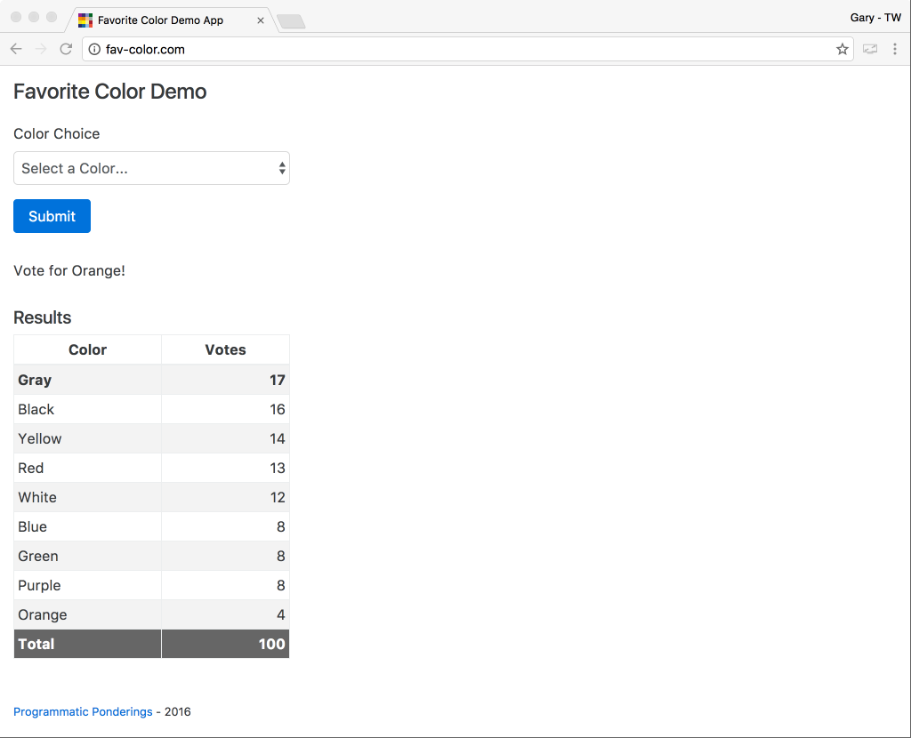
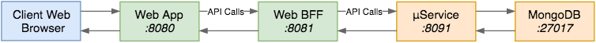
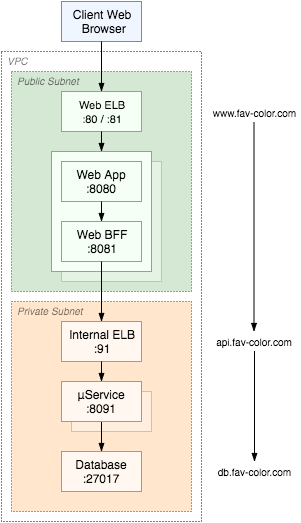

[](https://travis-ci.org/garystafford/fav-color-bff)

# Favorite Color Web Backend For Frontend (BFF)

## Introduction

The Favorite Color Web Browser Backend For Frontend ([BFF](http://samnewman.io/patterns/architectural/bff/)), is part of a multi-tier, Angular-Node-Spring-MongoDB sample application. A BFF is used to fine-tune the API payloads to the specific requirements of client's interface, in this case web browsers, as opposed to other interfaces, such as native Android, iOS, or embedded device.

This web browser BFF merely simulates the functionality of a real BFF, and contains no user interface logic. Currently, the BFF is merely a Node.js-based reverse-proxy server, built with [Nodejitsu](https://nodejitsu.com/) [http-proxy](https://www.npmjs.com/package/http-proxy). The BFF proxies RESTful API calls from the [Favorite Color Web Application](https://github.com/garystafford/fav-color-ngweb) to the [Favorite Color Spring Boot μService](https://github.com/garystafford/fav-color-service). For example, a call to the `/choices` endpoint at `https://bff.web.fav-color.com:8081/choices`, from the web application, will be proxied through the BFF, to the private backend μService endpoint `/choices` at `http://api.fav-color.com/choices`.

The entire sample application platform is designed to be provisioned and deployed to AWS, using HashiCorp Packer and Terraform. The web application and BFF are designed to sit in the public subnet behind a load balancer, while the μService(s) and database(s) sit in the private subnet, also behind an internal load balancer.



## Quick Start for Local Development

The Web BFF requires that the [Favorite Color μService](https://github.com/garystafford/fav-color-service) and MongoDB are all up and running locally. To clone, build, and run the Web BFF, using the following commands:

```bash
git clone https://github.com/garystafford/fav-color-bff.git
cd fav-color-bff
npm install
npm start
```

The Web BFF should start successfully on the default host and port of `http://localhost:8081`, and be ready to take calls from the web application and proxy them to the service.



## Configuration Management

Informational only, the project uses the [config](https://www.npmjs.com/package/config) npm package for specifying environment specific configuration. Each environment is represented by a separate JSON configuration file, in the `config` directory, located in the root of the project. There is also a default `default.json`, intended for local development.

```json
{
  "port": "8081",
  "api": {
    "description": "Call the service directly in a local development environment",
    "url": "localhost",
    "port": "8091"
  }
}
```

Setting the `NODE_ENV` environment variables, either by exporting it in advance, or on the command-line when the application is started, dictates which config file is used. For example, using `NODE_ENV=production` specifies that the `production.json` will be used to source environment specific configuration.

The code is written, such that all configuration in the configuration file can be overridden using environment variables, exported in advance, or on the command-line when the application is started. For example, to change the BFF listening port and service port to proxy request to, when starting the BFF, run:

```bash
WEB_BFF_PORT=1234 API_PORT=5678 node app.js
```

## Build Production Distribution

The Web BFF uses [Gulp](http://gulpjs.com/), with [Babel](https://www.npmjs.com/package/gulp-babel), for workflow automation. To create the `dist` directory, in the project's root directory, for deployment to Production, use one Gulp command, `gulp dist`. This command aggregates several other commands together to build a deployable build artifact.

```bash
gulp dist
```

## Run in Production

After deploying the contents of the `dist` directory, run the following commands from within the `dist` directory.

```bash
NODE_ENV=production npm install
node app.js
```

Using `NODE_ENV=production` means that only required npm packages in the `dependencies` section of the `package.json` will be installed, not npm packages in the `devDependencies` section.

In addition, setting `NODE_ENV=production` means that the `production.json` will be used to source environment specific configuration. Note this file will need to be modified for your use; its values are specific to my AWS Production environment.

```json
{
  "port": "8081",
  "api": {
    "description": "Calls the internal Service ELB in the AWS Production environment",
    "url": "api.fav-color.com",
    "port": "91"
  }
}
```

Remember, you can override the configuration using environment variables on the command-line, as shown above.



## Reference

- [Splitting a gulpfile into multiple files](http://macr.ae/article/splitting-gulpfile-multiple-files.html)
- [Pattern: Backends For Frontends](http://samnewman.io/patterns/architectural/bff/)
- [BFF @ SoundCloud](https://www.thoughtworks.com/insights/blog/bff-soundcloud)
